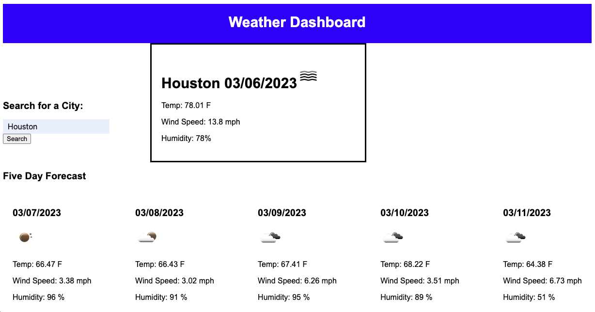

# Weather-Dashboard

## Description

For this assignment I was tasked with creating a weather dashboard. The dashboard includes a search bar that allows the user to search for a city. When the city is searched for, the results appear on the page that lists the current temperature and the weather report for the next five days. The date, an icon representing the current weather conditions, the temperature, the humidity, and the wind speed are all displayed. When a user searches a city then that city is saved in the search history underneath the search bar. When the user clicks on a previously searched city, they are presented with the weather for that city again. 

## Screenshot

## Link to deployed application 

https://sethdaulton.github.io/Weather-Dashboard/
